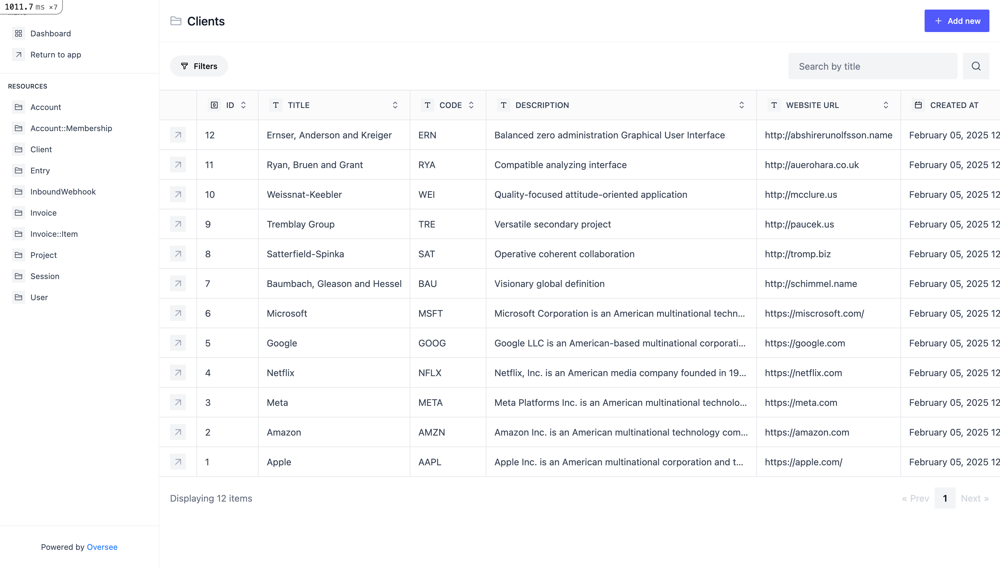

[](https://badge.fury.io/rb/oversee)

# 👓 Oversee

Plug & play admin dashboard for Rails applications.



Developed by [Primevise](https://primevise.com)

> [!NOTE]
> Oversee is still rather incomplete and only has the very basic features. It might significantly change and break things before a stable release.

## Installation

Add it to your application by running

```bash
$ bundle add oversee
```

or add this line to your application's Gemfile:

```ruby
gem "oversee"
```

And then run:

```bash
$ bundle
```

## Contributing

TBA

## Notable mentions

This gem is inspired by other open source admin dashboards. A big thank you goes to these projects:

- [madmin](https://github.com/excid3/madmin)
- [Avo](https://github.com/avo-hq/avo)

## License

The gem is available as open source under the terms of the [MIT License](https://opensource.org/licenses/MIT).
